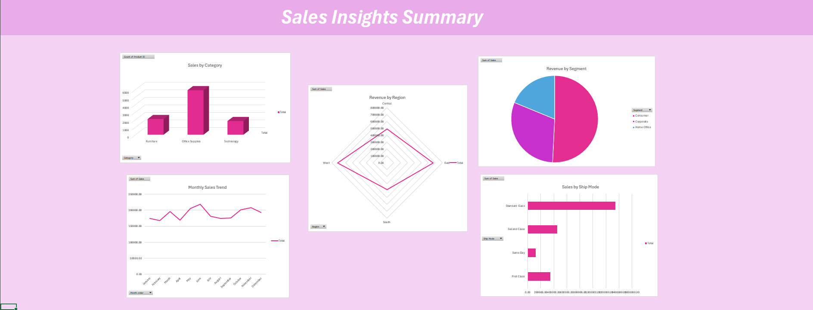
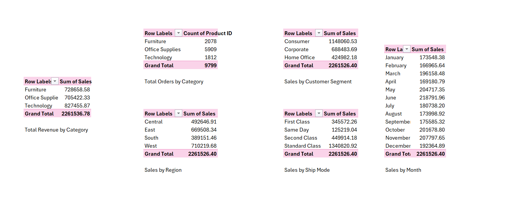

# 📊 Superstore Sales Dashboard

An interactive **Excel dashboard** built from the [Superstore Sales dataset](https://www.kaggle.com/datasets/rohitsahoo/sales-forecasting) using **Power Query** and **PivotTables**.  
Download the Excel file [Elevvo task 1.xlsb.xlsx](https://github.com/Salmaraafat/Superstore-Sales-Dashboard/raw/main/Elevvo%20task%201.xlsb.xlsx).

---

## ✨ Features

- Data cleaned & transformed in **Power Query**
- KPIs for:
  - 💰 Total Revenue
  - 📦 Number of Orders
  - 📊 Average Order Value
- Interactive charts showing:
  - Monthly sales trends
  - Revenue by Region
  - Revenue by Category
  - Sales by Segment
- **Slicers** for easy filtering by Region, Category, or Segment

---

## 🛠 Tools Used

- Microsoft Excel (Power Query, PivotTables, Charts, Slicers)
- Dataset: Superstore Sales (Kaggle)

---

## 🚀 How to Use

1. Download the file [`Elevvo task 1.xlsb.xlsx`](https://github.com/Salmaraafat/Superstore-Sales-Dashboard/raw/main/Elevvo%20task%201.xlsb.xlsx) from this repository.
2. Open it in Microsoft Excel.
3. Explore the dashboard: use slicers to filter, view KPIs, and interact with charts.

---

## 🖼 Screenshots

### 📌 Dashboard Overview

---

## 📊 Data Analysis

---

## 🤝 Contributing

Pull requests are welcome. For major changes, please open an issue first to discuss what you'd like to change.

---

## 📄 License

This project is open-source.  
Feel free to use and adapt it for your own learning or portfolio.
